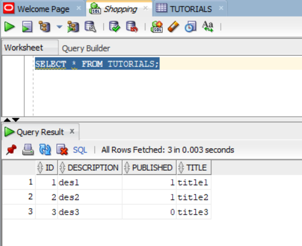
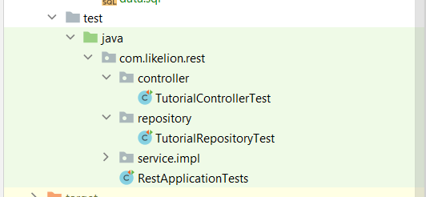
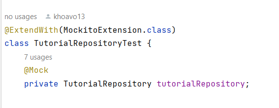
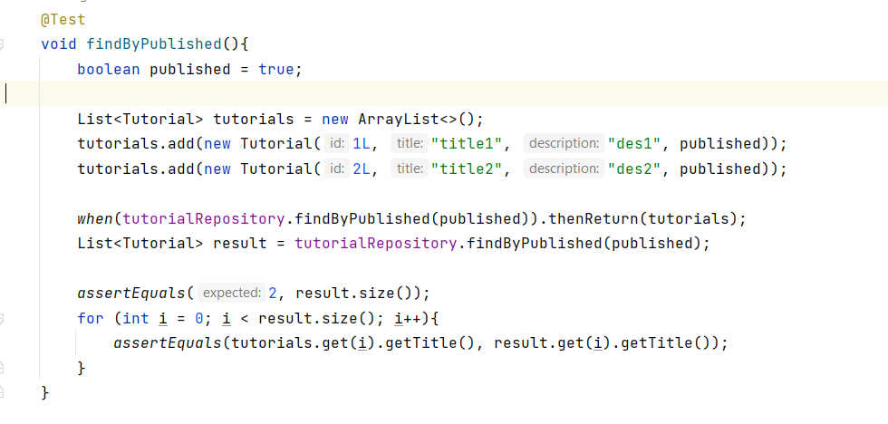
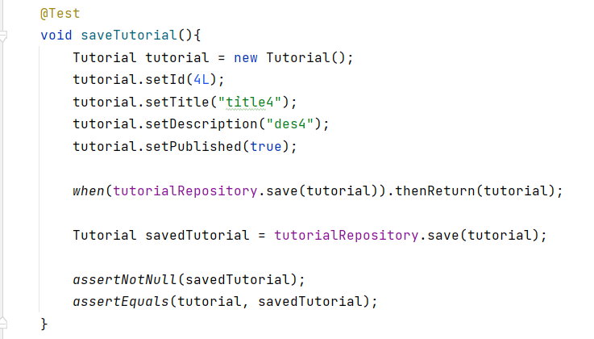
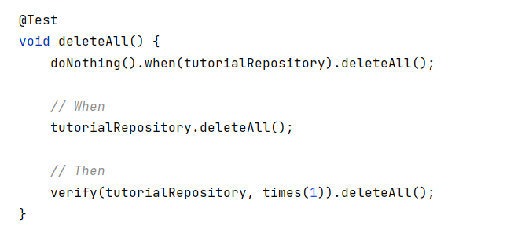
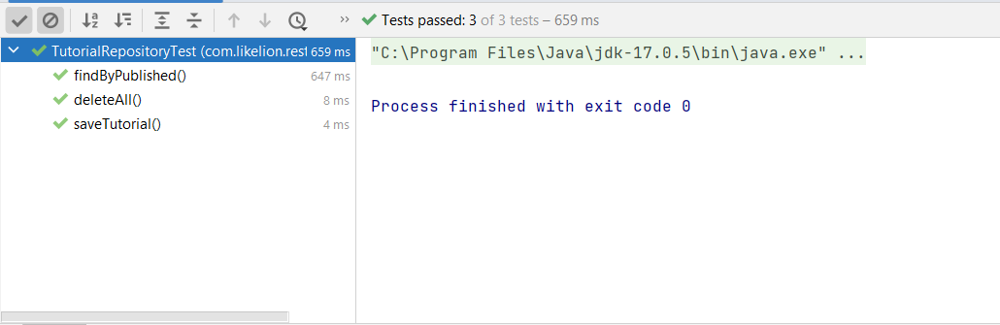

# Practice: Spring Boots Test, Devtools, Actutor

## Part 1

### 1.1. Project Structure: Reuse old Rest API project (JPA + OracleDB)


### 1.2. Write test cases for each layer (Using JUnit + Mockito)

  * **Sample Oracle database used during testing**  
---


* **Test Folder Structure**
---


#### 1.2.1. CRUD methods for the repository layer

* **Inject Bean into TutorialRepositoryTest**
  ````
  * @Mock: virtual object, which simulates the behavior and properties of the real object
  ````


* **GET: find by published** 


* **CREATE/UPDATE: save Tutorial**


* **DELETE: delete all Tutorials**


* **Result: Pass all test cases**


#### 1.2.2. Write test cases for service layer methods