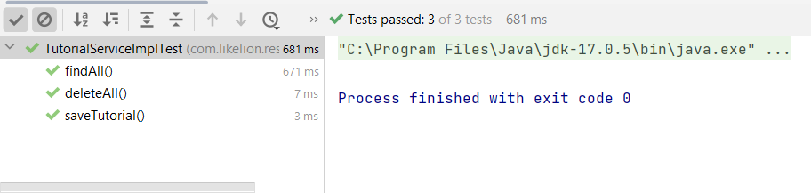

# Practice: Spring Boots Test, Devtools, Actutor

## Part 1: Unit testing in JUnit 5 and Mockito

### 1.1. Project Structure: Reuse old Rest API project (JPA + OracleDB)


### 1.2. Write test cases for each layer

  * **Sample Oracle database used during testing**  
---


* **Test Folder Structure**
---


#### 1.2.1. CRUD methods for the Repository layer

* **Setup class TutorialRepositoryTest**
  ````
  * @Mock: virtual object, which simulates the behavior and properties of the real object
  ````


* **GET: find by published** 


* **CREATE/UPDATE: save Tutorial**


* **DELETE: delete all Tutorials**


* **Result: Pass all test cases**


#### 1.2.2. Write test cases for Service layer methods
* **Setup class TutorialServiceImplTest**


* **Find all Tutorials** 


* **Save Tutorial**


* **Delete all Tutorials**


* **Result: Pass all test cases**


#### 1.2.2. Write test cases for API of Controller layer
* **Setup class TutorialControllerTest**


* **API: GET /api/tutorials** 


* **API: GET /api/tutorials/{id}**


* **API: GET /api/tutorials/published**


* **API: POST /api/tutorials**

* **API: PUT /api/tutorials/{id}**

* **API: DELETE /api/tutorials/{id}**

* **API: DELETE /api/tutorials/**


* **Result: Pass all test cases**


## Part 2: Setting Actuator and DevTools


### 2.1. Spring Boot Actuator
##### Dependence
  ````
  <dependency>
		<groupId>org.springframework.boot</groupId>
		<artifactId>spring-boot-starter-actuator</artifactId>
  </dependency>

  ````
##### The corresponding configuration in the file application.properties

* Set up port 8090 for monitoring management
* Set enable for all endpoints
* Shut down the application using Actuator
  
##### Result
* Run-time port 8090

* Actuator Endpoints
  
  
* Actuator Health
   
* Actuator ShutDown
  * Postman request **API: POST /actuator/shutdown**
  

  * Console
  

### 2.2. DevTools
* **Dependence**
  ````
  <dependency>
	<groupId>org.springframework.boot</groupId>
	<artifactId>spring-boot-devtools</artifactId>
	<scope>runtime</scope>
	<optional>true</optional>
  </dependency>
  ````

* **Settings when using IntelliJ**
  

* **The program is running on port 8090**
  

  
* **Set up port 8091 for monitoring management**
* **Endpoints after changing port 8091**
  * Port 8090:
  
  * Port 8091:
  
  

